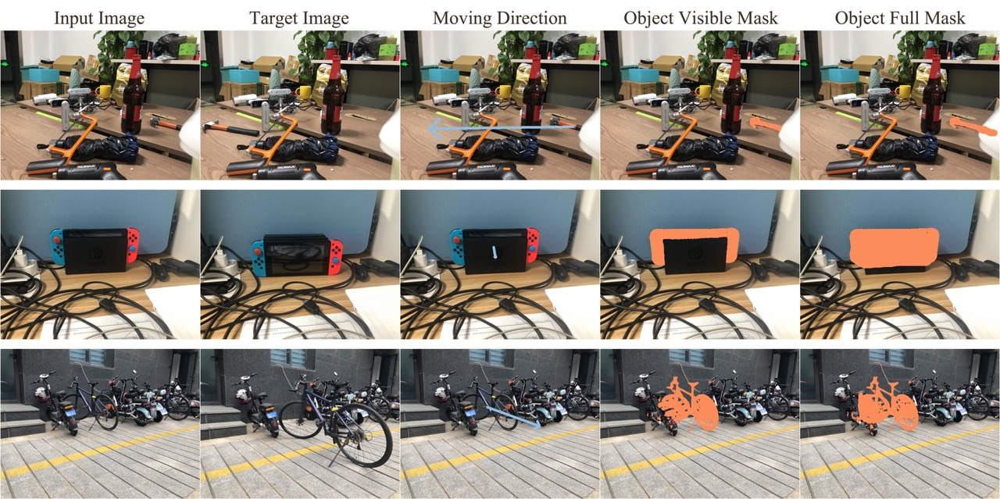
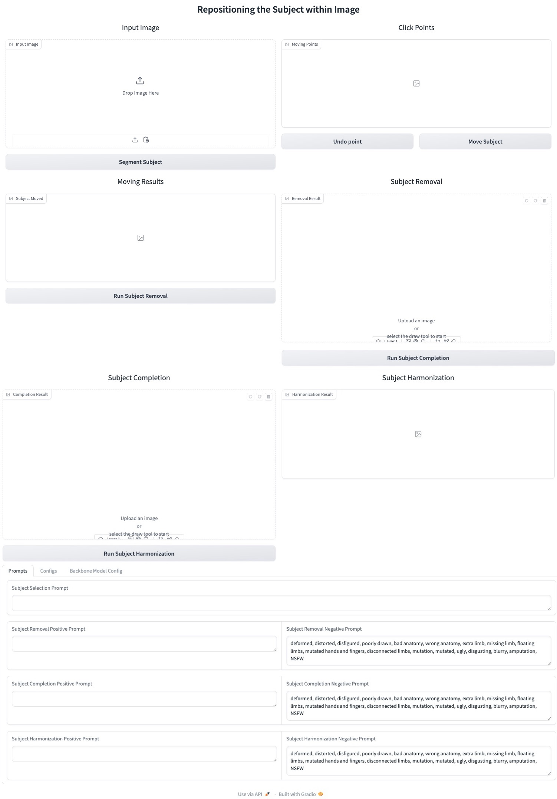

<p align="center">
  <h1 align="center">Repositioning the Subject within Image</h1>
  <p align="center">
    <strong>Yikai Wang</strong>
    &nbsp;&nbsp;
    <strong>Chenjie Cao</strong>
    &nbsp;&nbsp;
    <strong>Ke Fan</strong>
    &nbsp;&nbsp;
    <strong>Qiaole Dong</strong>
    &nbsp;&nbsp;
    <strong>Yifan Li</strong>
    &nbsp;&nbsp;
    <strong>Xiangyang Xue</strong>
    &nbsp;&nbsp;
    <strong>Yanwei Fu</strong>
    &nbsp;&nbsp;
  </p>
  <br>
  <p align="center">
    <a href="https://arxiv.org/abs/2401.16861"></a>
    <a href="https://yikai-wang.github.io/seele/"></a>

  </p>
  <br>
</p>

## Disclaimer
This repo is the author reimplementation of key components in the paper **Repositioning the Subject within Image** based on public available sources, the original paper, and GPT.

This repo and the ReS dataset is intended to use for reserach purpose only, and we respect all the license of used models and codes. Users are granted the freedom to create images using this tool, but they are expected to comply with local laws and utilize it in a responsible manner. The developers do not assume any responsibility for potential misuse by users.

## Known issues
- Due to the gradio [bug](https://github.com/gradio-app/gradio/issues/7685), currently the webui only supports maximum image resolution of less than 800x600. We will update the support for larger resolution after the bug is fixed.
- Due to the perspective shift, the size and the view of the subject after repositioning will change. We don't provide annotations for this, so using the target image directly for quantitative analysis may not be accurate.
- We have found that relying only on learnable prompts doesn’t always fix the issue of generating random elements during the subject-removal step.
For a more advanced solution, check out our paper on addressing [context instability](https://yikai-wang.github.io/asuka/).


## Updates

 - [x] Release the training data construction code.
 - [x] Release the webui.
 - [x] Release the ReS dataset.


## ReS dataset



> We curated a benchmark dataset called ReS. This dataset includes 100 paired images, featuring a repositioned subject while the other elements remain constant. These images were collected from over 20 indoor and outdoor scenes, showcasing subjects from more than 50 categories. This variety enables effective simulation of real-world open-vocabulary applications.

### Download

The Res Dataset is available at [Google Drive](https://drive.google.com/file/d/1mqZDL0SjAyLA0r7zeLgyEo3pvLXVE8Va/view?usp=sharing), [Baidu Netdisk](https://pan.baidu.com/s/16P4aNvCS4LmyoVFpfH2Vlw?pwd=eva0).


### Structure

Unzip the file, and you will get a folder including:

```
pi_1.jpg # The first view of the scene i
pi_2.jpg # The second view of the scene i
pi_1_mask.png # The visiable mask of subject in the first view
pi_1_amodal.png # The full mask of subject in the first view
pi_2_mask.png # The visiable mask of subject in the second view
pi_2_amodal.png # The full mask of subject in the second view
```

The images were taken using two different mobile devices. Some are sized 1702x1276, while others are 4032x3024. Each pair has the same resolution.

The masks corresponding to these images are annotated based on SAM, with a maximum length of 1024.

### Loading

We provide an example script [Res.py](ReS/ReS.py) for loading the ReS dataset.

In the script, we define a class **ReS** that is initialized with:
```
res = ReS(root_dir, img_size, load_square)
```
The first parameter is the folder path, the ```img_size``` is the minimum side length you want. If you set ```load_square``` to true, the images will be resized as square images.

Paired images represent two tasks in this context, with each task starting from one side. If an image is occluded, we only use it as the source image.

The ```__getitem__``` function processes a specific task and outputs a dict with
```
'image': the source image
'mask': the remove mask of the subject in the source location
'gt': the target image
'amodal': the complete mask of the subject in the target location
'size': resolution of the image
'masked_image': masked image
```
We assume the results are inputed to the SD. Please adjust the function as needed for your convenience.


## Webui



We updated the models to more powerful versions than the ones used in our papers.
We use the backbone diffusion model of [SD3-Controlnet-Inpainting](https://huggingface.co/alimama-creative/SD3-Controlnet-Inpainting), an inpainting variant of SD3 trained by alimama-creative.
The segmentation model is [sam2-hiera-tiny](https://github.com/facebookresearch/sam2).

### Installation

To install the required libraries, simply run the following command:
```
conda env create -f environment.yaml
conda activate seele
```

### Run SEELE demo
To start with, in command line, run the following to start the gradio user interface:
```
python seele_webui.py
```
The prompt in the webui is implemented as text prompt. To utilize trained prompts, please modify the corresponding part in the python file.

## Training
We provide the code for creating training pairs for each sub-task.
You can use the training scirpts of the [textual inversion codebase](https://huggingface.co/docs/diffusers/en/training/text_inversion) from Diffusers.
To do this, set ```--num_vectors``` to your desired number and ```--initializer_token``` to an appropriate text instruction.
Note that this training script saves the prompts before they are sent to the text condition model.
If you want to save memory during inference, it's better to store the embeddings produced by the text condition model instead.

## License
Code related to the SEELE algorithm is under Apache 2.0 license.


## BibTeX
If you find our repo helpful, please consider cite our paper :)
```bibtex
@article{
wang2024repositioning,
title={Repositioning the Subject within Image},
author={Wang, Yikai and Cao, Chenjie and Fan, Ke and Dong, Qiaole and Li, Yifan and Xue, Xiangyang and Fu, Yanwei},
journal={Transactions on Machine Learning Research},
year={2024},
}
```

## Acknowledgement
The gradio demo implementation is based on [DragDiffusion](https://github.com/Yujun-Shi/DragDiffusion/tree/main).


